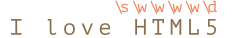

# Kelas-kelas Karakter (Character classes)

Bayangkan sebuah tugas praktik -- kita memiliki sebuah nomor telepon `"+7(903)-123-45-67"`, dan kita harus mengubah nomor telepon tersebut menjadi angka murni: `79031234567`.

Untuk melakukan hal itu, kita harus menemukan apapun yang bukan merupakan angka. Kelas karakter dapat membantu membereskan hal tersebut.

Sebuah *Kelas Karakter* adalah sebuah notasi yang spesial yang membandingkan simbol apapun dengan aturan tertentu.

Untuk memulai, ayo kita *explore* kelas "angka" (digit). Kelas "angka" ditulis seperti `pattern:\d` dan dapat disamakan dengan "setiap angka yang ada".

Untuk contoh, kita akan mencoba mencari angka pertama pada nomor telepon:

```js run
let str = "+7(903)-123-45-67";

let regexp = /\d/;

alert( str.match(regexp) ); // 7
```

Tanpa tanda `pattern:g`, ekspresi regularnya hanya akan mencari satu kecocokan, yaitu angka pertama `pattern:\d`.

Coba kita tambahkan tanda `pattern:g` untuk mencari seluruh angka:

```js run
let str = "+7(903)-123-45-67";

let regexp = /\d/g;

alert( str.match(regexp) ); // array: 7,9,0,3,1,2,3,4,5,6,7

// kita coba untuk membuat "hanya angka" dari nomor teleponnya:
alert( str.match(regexp).join('') ); // 79031234567
```

Itu adalah kelas karakter untuk angka. Tentu saja ada karakter kelas lainnya.

Yang paling banyak digunakan adalah:

`pattern:\d` ("d" untuk "digit" / "angka")
: Angka: adalah karakter dari `0` sampai `9`.

`pattern:\s` ("s" untuk "space" / "spasi" / untuk mencari *whitespace*)
: Simbol *space* / spasi: termasuk spasi, *tabs* `\t`, garis baru `\n` dan beberapa karakter lainnya yang jarang digunakan, seperti `\v`, `\f` dan `\r`.

`pattern:\w` ("w" untuk "word" / "karakter kata")
: "karakter kata": antara sebuah huruf dari alfabet latin atau sebuah angka atau sebuah *underscore* `_` (a-z, A-Z, 0-9). `pattern:\w` tidak bisa digunakan untuk huruf yang bukan huruf latin (seperti *cyrillic* atau *hindi*).

Contohnya, `pattern:\d\s\w` menandakan sebuah "digit" yang diikuti dengan "karakter *space*" diikuti dengan "karakter kata", seperti `match:1 a`.

**Regular ekspresi mungkin mengandung simbol dan kelas karakter.**

Contoh, `pattern:CSS\d` cocok dengan *string* `match:CSS` dengan angka setelahnya:

```js run
let str = "Apakah CSS4 telah rilis?";
let regexp = /CSS\d/

alert( str.match(regexp) ); // CSS4
```

Dan juga kita bisa menggunakan banyak kelas karakter:

```js run
alert( "I love HTML5!".match(/\s\w\w\w\w\d/) ); // ' HTML5'
```

Kecocokannya (setiap karakter kelas regexp yang menghasilkan hasil yang sesuai):



## Kelas kebalikan (Inverse Classes)

Untuk setiap kelas karakter yang ada terdapat sebuah "kelas kebalikan", ditunjukan dengan huruf yang sama, tapi dengan huruf besar / kapital.

"Kebalikan" berarti kelas tersebut cocok dengan seluruh karakter lainnya, contoh:

`pattern:\D`
: Bukan angka: karakter apapun kecuali `pattern:\d`, contoh huruf.

`pattern:\S`
: Bukan spasi: karakter apapun kecuali `pattern:\s`, contoh huruf.

`pattern:\W`
: Bukan karakter kata: apapun kecuali `pattern:\w`, contoh huruf yang bukan latin atau sebuah spasi.

Pada awal bab kita melihat bagaimana cara membuat nomor telepon yang hanya angka dari string seperti `subject:+7(903)-123-45-67`: cari seluruh angka dan gabungkan.

```js run
let str = "+7(903)-123-45-67";

alert( str.match(/\d/g).join('') ); // 79031234567
```

Alternatif, cara pendeknya adalah dengan mencari karakter yang bukan angka dan hilangkan dari stringnya:

```js run
let str = "+7(903)-123-45-67";

alert( str.replace(/\D/g, "") ); // 79031234567
```

## Sebuah titik adalah "karakter apapun"

Sebuah titik `pattern:.` adalah sebuah kelas karakter spesial yang cocok "dengan karakter apapun kecuali garis baru".

Contoh:

```js run
alert( "Z".match(/./) ); // Z
```

Atau ditengah dari sebuah ekspresi regular:

```js run
let regexp = /CS.4/;

alert( "CSS4".match(regexp) ); // CSS4
alert( "CS-4".match(regexp) ); // CS-4
alert( "CS 4".match(regexp) ); // CS 4 (spasi juga merupakan karakter)
```

Ingatlah bahwa titik berarti "karakter apapun", tapi bukan sebuah "ketiadaan karakter". Harusnya ada karakter yang mirip dengannya:

```js run
alert( "CS4".match(/CS.4/) ); // null, tidak ada yang cocok karena tidak terdapat karakter untuk titiknya.
```

### Titik secara literal adalah karakter apapun dengan tanda "s"

Pada dasarnya, sebuah titik tidak cocok dengan karakter garis baru `\n`.

Contoh, ekspresi regular `pattern:A.B` cocok dengan `match:A`, dan lalu `match:B` dengan karakter apapun diantaranya, kecuali garis baru `\n`:

```js run
alert( "A\nB".match(/A.B/) ); // null (tidak ada yang cocok)
```

Terdapat beberapa situasi ketika kita ingin memperlakukan titik sebagai "karakter apapun", garis baru termasuk.

Itulah yang dilakukan oleh `pattern:s`. Jika sebuah ekspresi regular memilikinya, maka sebuah titik `pattern:.` secara literal cocok dengan karakter apapun:

```js run
alert( "A\nB".match(/A.B/s) ); // A\nB (cocok!)
```

````warn header="Tidak didukung IE"
Tanda `pattern:s` tidak didukung pada IE.

Beruntungnya, masih terdapat alternatif untuk hal itu yang mana dapat berjalan dimanapun. Kita bisa menggunakan *regexp* seperti `pattern:[\s\S]` untuk dicocokan dengan "karakter apapun" (pola ini akan dijelaskan pada bab <info:regexp-character-sets-and-ranges>).

```js run
alert( "A\nB".match(/A[\s\S]B/) ); // A\nB (cocok!)
```

Pola `pattern:[\s\S]` bisa dikatakan: "sebuah karakter spasi ATAU bukan sebuah karakter spasi". Dengan kata lain, "apapun". Kita bisa menggunakan kelas komplemen pasangan lainnya, seperti `pattern:[\d\D]`, itu tidak penting. Atau bahkan `pattern:[^]` -- sama seperti mencocokan karakter apapun kecuali tidak ada.

Kita juga bisa menggunakan trik ini jika kita ingin dua bentuk "titik" didalam pola yang sama: titik yang sebenarnya `pattern:.` bertingkah seperti biasa ("tidak termasuk garis baru"), dan juga sebuah cara untuk mencocokan "karakter apapun" dengan `pattern:[\s\S]` atau sejenisnya.
````

````warn header="Perhatikan spasinya"
Biasanya kita hanya memberikan sedikit perhatian pada spasi. Untuk kita string `subject:1-5` dan `subject:1 - 5` adalah hal yang hampir mirip.

Tapi jika sebuah ekspresi regular tidak memperhatikan spasinya, maka pencocokannya akan gagal.

Kita coba untuk mencari angka yang dipisahkan dengan tanda penghubung:

```js run
alert( "1 - 5".match(/\d-\d/) ); // null, tidak cocok!
```

Sekarang kita benarkan dengan menambahkan spasi pada regexp-nya `pattern: \d - \d`:

```js run
alert( "1 - 5".match(/\d - \d/) ); // 1 - 5, sekarang pencocokannya bekerja
// atau kita bisa menggunakan kelas \s:
alert( "1 - 5".match(/\d\s-\s\d/) ); // 1 - 5, juga bekerja
```

**Sebuah spasi adalah sebuah karakter. Sama pentingnya dengan karakter lainnya**

Kita tidak bisa menambah atau menghilangkan spasi dari ekspresi regular dan berharap pencocokanya akan berjalan sama.

Dengan kata lain, didalam ekspresi regular seluruh karakter bersifat penting, spasi pun sama.
````

## Ringkasan

Terdapat karakter kelas:

- `pattern:\d` -- digits / Angka.
- `pattern:\D` -- non-digits / Bukan angka.
- `pattern:\s` -- simbol spasi, tabs, garis baru.
- `pattern:\S` -- semuanya kecuali `pattern:\s`.
- `pattern:\w` -- huruf latin, angka, *underscore* `'_'`.
- `pattern:\W` -- semuanya kecuali `pattern:\w`.
- `pattern:.` -- karakter apapun jika dengan regexp tanda `'s'`, sebaliknya semuanya kecuali sebuah garis baru `\n`.

...Tapi ini belum semuanya!

*Unicode encoding*, digunakan oleh Javascript untuk *string*, menyediakan berbagai properti untuk karakter, seperti: bahasa mana yang cocok dengan surat ini (jika sebuah surat), tanda bacanya, dll.

We can search by these properties as well. That requires flag `pattern:u`, covered in the next article.
Tentu saja kita bisa mencari dengan propertinya. Yang mana membutuhkan tanda `pattern:u`, yang akan dibahas didalam bab selanjutnya.
